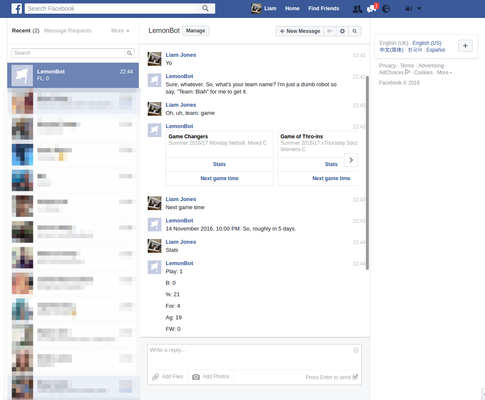

# lemonbot

## What is it?

Lemonbot is *very* basic Facebook chatbot that will scrape game time and team information regarding a requested team from a sporting facility's website.

## How do I use it?

1. Browse to the [LemonBot page](https://www.facebook.com/LemonBot-1763943487196046/) and click 'Message', or use [this link](http://m.me/1763943487196046) to open a conversation directly.
2. Send a message! It'll tell you what to do. If that's a bit daunting, the screenshot below covers all the functionality.

P.S., it wasn't very nice of me to say dumb robot, was it. :(

## Why make it?

1. I had wanted an excuse to play with Zappa and this was a suitable use case.
2. I play netball at this venue and want to make something more convenient for myself than checking their website.
3. I needed a project for a university unit relating to cloud computing (CITS5503) that demonstrates a practical application of AWS Lambda.

## What does it use?

* [Facebook Messenger Platform](https://developers.facebook.com/docs/messenger-platform)
* [Zappa](https://github.com/Miserlou/Zappa)
  * Python 2.7.12
  * Flask
  * AWS Lambda

### Functional requirements

* Respond to messages
* Respond to requests for information about a team's current standing and stats.
* Respond to requests for information about the time and date of a team's next game.
* Scrape relevant information from the sporting facility's website

### Non-functional requirements

* Cheap to run
* Easy to extend
* Easy to use
* Respond quickly (i.e., within a few seconds)
* Run on Facebook
* Scale horizontally (because Lambda, yay)

## How could it be improved?

* Cache scraped results to prevent spamming of the origin with scrape requests
* Handling of time zones! Currently AWST is locked in
* Send messages regarding game time on a schedule, e.g., the day before the game
* Store 'favourites' or at least associate a team/teams with a user so that users don't need to request by teams name each time

## Resources

While I looked at a few guides and tutorials, there were three resources used primarily.

* Facebook's very own [documentation](https://developers.facebook.com/docs/messenger-platform) on the Messenger Platform.
* Hartley Brody's [blog post](https://blog.hartleybrody.com/fb-messenger-bot/)  on using Python / Flask to create a chatbot, and the accompanying [github](https://github.com/hartleybrody/fb-messenger-bot) repository.
* The Zappa project's [documentation](https://github.com/Miserlou/Zappa).

Brody's blog post is a great place to get started with the very basics, and will get you to the point of having a bot that will give a generic response to any messages. This project extends on that by...

* Implementing a rudimentary message router. This is part of a general aim to create smaller, more specific functions
* Templates for different types of responses / messages available in Facebook (e.g., simple text message, or a message with buttons?)
* All the website scraping and parsing stuff
* Handling of message seen, typing on/off indicators
* Postback message handling

## Fun Facebook caveats

* No more than three buttons in an message/element
* No more than ten 'bubbles' or elements per message
* It looks like Facebook retries failed messages when you have broken code. That's good except that it can make your logs hard to follow sometimes.